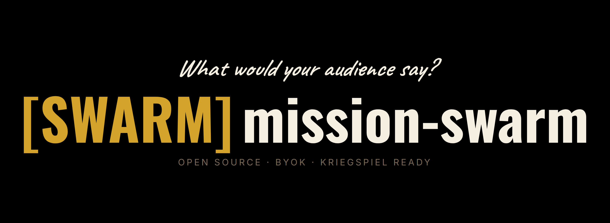

# MissionSwarm



A lightweight swarm-simulation engine: feed it a document (press release,
event summary, news article, campaign brief) and it generates a set of
personas whose reactions, disagreements, and opinion drift unfold round
by round in real time.

Stack: TypeScript + Bun. No Neo4j. No external DB. No required GPU. LLM
calls via OpenRouter (default) or Ollama (local). Persistence is
JSON-per-simulation.

## What it is

The lean ~20% of MiroShark that's useful for kriegspiel and
product-launch reaction simulation, rebuilt from scratch as a
standalone tool. MiroShark
(`github.com/aaronjmars/MiroShark`) ships a research-grade knowledge-
graph stack, multi-platform simulation (Twitter / Reddit / Polymarket),
belief-state tracking, and a ReACT reporting agent. Powerful, but
heavy enough that running it locally without a good GPU is painful.

MissionSwarm keeps the part most users actually want: plausible
persona reactions to input content, streamable live, and drops
everything else. The kriegspiel framing: when a wargame or
strategic-scenario project needs "how does the domestic / foreign /
media audience react to this event?", MissionSwarm answers in a form
the broader simulation can consume.

## What it is not (v1 scope boundaries)

- **Not a knowledge graph.** No Neo4j, no entity extraction, no
  temporal queries. The whole input document goes into each persona's
  context.
- **Not multi-platform.** No Twitter/Reddit/Polymarket split. Just
  "reactions" as an abstract stream.
- **Not a prediction market.** Skip the AMM layer entirely.
- **Not a belief-state engine.** Personas have simple stance + interest
  state per topic, not the graph-of-graphs state MiroShark tracks.
- **Not a reporting agent.** Optional post-simulation summary at most.

Scope is a deliberate fraction of MiroShark's. When a feature proves
needed by real use, graduate it. Default is to stay small.

## Intended use cases

- **Kriegspiel / wargame reactions.** Domestic political factions,
  foreign observers, military commentators, media outlets reacting to
  in-game events or real-world scenario briefings. Primary v1 target.
- **Product-release reaction simulation.** How might the wargame
  community react to an AMFIOG announcement? The pixel-art community
  to a Retrogaze pivot? Press-release smoke-test.
- **General "public reacts to X"** sampling against any input
  document.

Audience profiles are pluggable. A config file per domain lives in
`audiences/` and shapes persona generation for that domain.

## Architecture (planned)

```
Input document + audience profile + config
              ↓
   Persona generator (LLM)
   → N personas with {name, bio, stance, interests, style}
              ↓
   Round loop (R rounds, each:)
   → for each persona:
   →   prompt: persona + recent round feed + input doc
   →   LLM call → reaction text + updated stance/interest
   → stream reactions to stdout / SSE
              ↓
   (optional) Summary report
```

State persistence: each simulation writes to `simulations/<id>/`
(config, persona list, per-round feed, stance trajectories).
`simulations/` is gitignored; only the code + `audiences/` templates
are tracked.

## Relationship to GeneralStaff

Registered in GS as a private-state Mode B project. MissionSwarm is
*not* a GS plugin in the architectural sense (no shared GS imports);
it's a standalone CLI tool that can be invoked from a GS-managed
project when needed. GS tracks MissionSwarm's own development tasks,
same way it tracks every other registered project.

Future option: a GS plugin surface could let GS-registered projects
declare `uses: [mission-swarm]` and auto-invoke MissionSwarm at
natural points (e.g., before a release task, generate a reactions
simulation). Out of scope for v1; flag for later.

## Privacy posture

Simulation outputs in `simulations/` stay on disk and gitignored.
They may contain domain-sensitive strategic content (pre-launch
announcement drafts, scenario briefs), so the directory is excluded
from version control by default. Audience profile templates in
`audiences/` are tracked because they're reusable shape definitions,
not project-specific content.

Bring-your-own-keys for paid providers. mission-swarm uploads input
only when you've configured a cloud provider via `.env`. The Ollama
path runs fully local; nothing leaves your machine on that path.

## Setup

```bash
git clone https://github.com/lerugray/mission-swarm.git
cd mission-swarm
bun install
cp .env.example .env   # configure OPENROUTER_API_KEY or Ollama endpoint
bun src/index.ts --help
```

## Sibling tools

Three other open-source tools share this repo's posture: your data
on your disk, your keys for paid providers, no SaaS layer.

- **[GeneralStaff](https://github.com/lerugray/generalstaff)**:
  multi-project bot orchestrator with hands-off enforcement and
  audit logging.
- **[mission-brain](https://github.com/lerugray/mission-brain)**:
  retrieval-only second brain over your own writing, citation-
  grounded.
- **[mission-bullet](https://github.com/lerugray/mission-bullet)**:
  AI-assisted bullet journal in the Ryder Carroll method.
